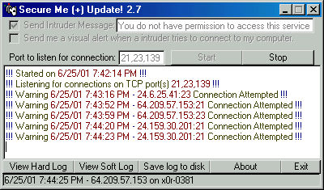

## Advanced Winsock And Parsing Secure me \+ 2\.7 UPDATE\!

### Description

After about 2 hours more of working on this.

I switched to RichEdit which allows me to do colors and other things. so now this is complete with color and a few updates. now all sockets unload and dont hang in memory ;) more error handling. Vote and leave a comment!
 
### More Info
 

             |
---                |---
**Submitted On**   |2001-06-25 19:40:24
**By**             |[meth0s](https://github.com/Planet-Source-Code/PSCIndex/blob/master/ByAuthor/meth0s.md)
**Level**          |Intermediate
**User Rating**    |5.0 (35 globes from 7 users)
**Compatibility**  |VB 4\.0 \(32\-bit\), VB 5\.0, VB 6\.0
**Category**       |[Internet/ HTML](https://github.com/Planet-Source-Code/PSCIndex/blob/master/ByCategory/internet-html__1-34.md)
**World**          |[Visual Basic](https://github.com/Planet-Source-Code/PSCIndex/blob/master/ByWorld/visual-basic.md)
**Archive File**   |[Advanced W216976252001\.zip](https://github.com/Planet-Source-Code/meth0s-advanced-winsock-and-parsing-secure-me-2-7-update__1-24437/archive/master.zip)

